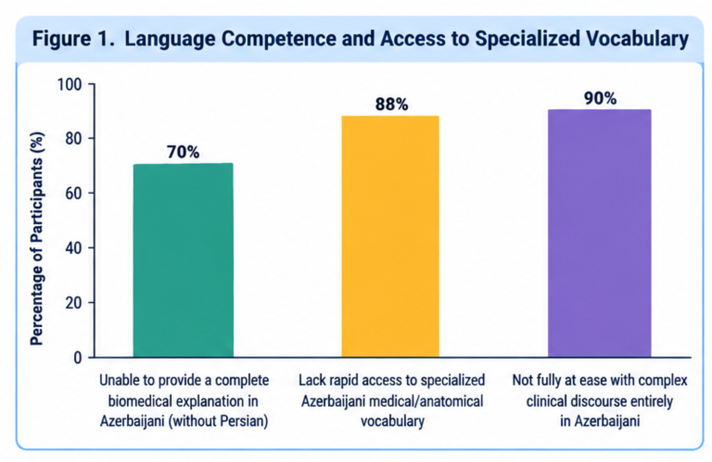
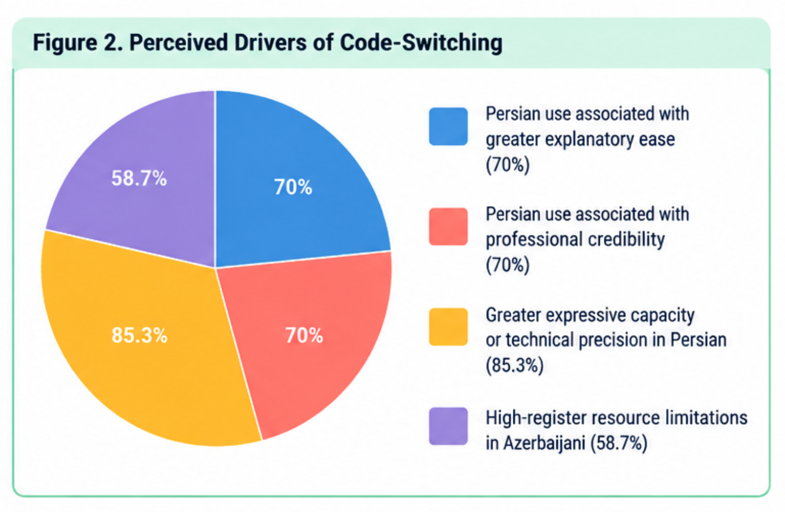
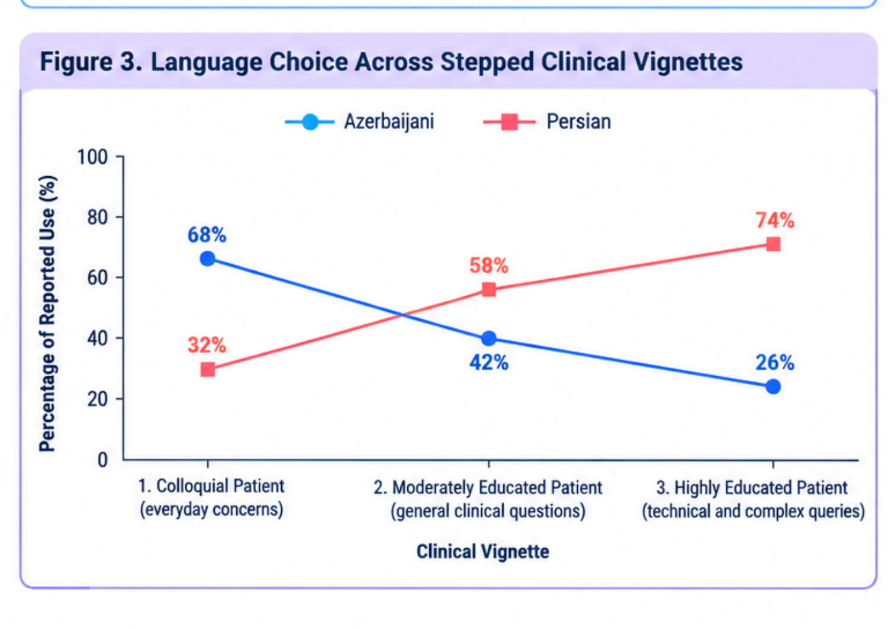
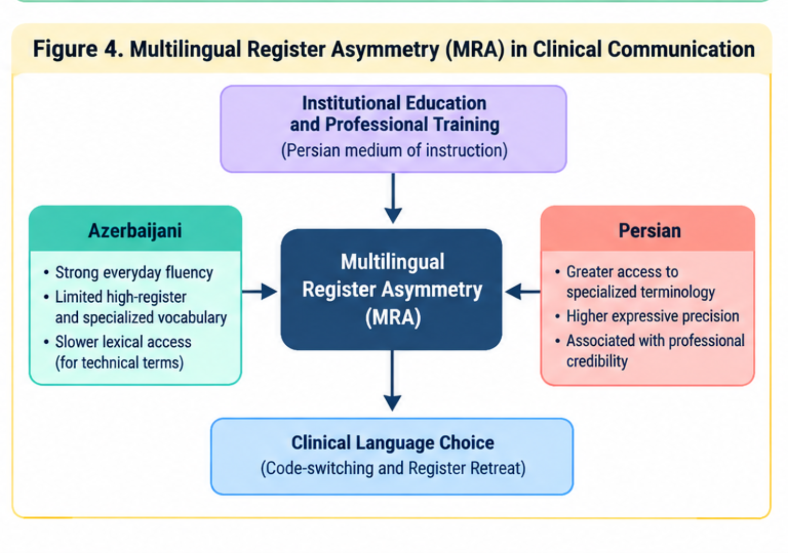

# Multilingual Register Asymmetry in Professional Communication: Azerbaijani–Persian Code-Switching and Register Retreat among Physicians in Iran

[](https://doi.org/)
[](https://creativecommons.org/licenses/by/4.0/)
[](https://www.python.org/)
[](#data-and-replication)

---

## 📌 Article Metadata & Citation
- **Title:** Multilingual Register Asymmetry in Professional Communication: Azerbaijani–Persian Code-Switching and Register Retreat among Physicians in Iran
- **Author:** Pegah Merrikhi
- **Scope:** Sociolinguistics, Clinical Communication, Multilingual Register Asymmetry (MRA), Register Retreat
- **DOI:** `10.5281/zenodo.23000825` *(Preprint / Repository Record)*
- **Data Availability:** Fully accessible in the [`data/`](./data/) and [`Figures/`](./Figures/) directories.

---

## 🖼️ Figures & Graphical Abstract

> **Note on Image Assets:** Figures reflect self-reported register access and domain distribution among Iranian Azerbaijani–Persian specialist physicians ($N=150$).

### Graphical Abstract

*Overview of Multilingual Register Asymmetry (MRA): Discrepancy between informal vernacular competence and specialized clinical registers.*

---

### Figure 1. Self-Reported Register Access & Lexical Retrieval

*Self-reported constraints when attempting complex clinical discourse exclusively in Azerbaijani ($N=150$).*

---

### Figure 2. Reported Drivers of Persian Lexical Insertion

*Self-reported motivations and structural factors prompting code-switching and lexical insertion into Persian.*

---

### Figure 3. Language Choice Across Stepped Clinical Vignettes

*Reported distribution of Azerbaijani vs. Persian across clinical communicative contexts (from informal greeting to high-complexity technical explanation).*

---

### Figure 4. Conceptual Framework of Multilingual Register Asymmetry

*Structural pathway illustrating how Persian-medium medical education conditions register retreat during high-complexity clinical encounters.*

---

## 📊 Summary Tables

### Table 1: Demographic and Professional Profile of Participants ($N=150$)

| Characteristic | Category | Count ($n$) | Percentage (%) |
| :--- | :--- | :---: | :---: |
| **Gender** | Female | 75 | 50.0% |
| | Male | 75 | 50.0% |
| **Age Group** | 45–55 years | 120 | 80.0% |
| | >55 years | 30 | 20.0% |
| **Clinical Experience** | 11–20 years | 120 | 80.0% |
| | >20 years | 30 | 20.0% |
| **Medical Specialty** | Gynecology & Obstetrics | 45 | 30.0% |
| | Urology | 30 | 20.0% |
| | Cardiology | 30 | 20.0% |
| | ENT (Otorhinolaryngology) | 15 | 10.0% |
| | Specialized Dentistry | 15 | 10.0% |
| | Internal Medicine | 15 | 10.0% |

---

### Table 2: Self-Reported Clinical Register Constraints in Azerbaijani

| Dimension / Survey Focus | Reported Constraint | Affirmative ($n$) | Affirmative (%) |
| :--- | :--- | :---: | :---: |
| **Biomedical Explanations** | Need Persian lexical insertion for technical accuracy | 105 | 70.0% |
| **Rapid Lexical Access** | Slower or constrained retrieval of technical terms in Azerbaijani | 132 | 88.0% |
| **Complex Clinical Delivery** | Not fully comfortable maintaining complex discourse purely in Azerbaijani | 135 | 90.0% |

---

### Table 3: Reported Primary Drivers for Persian Code-Switching

| Reported Driver / Rationale | Physician Response Category | Affirmative ($n$) | Percentage (%) |
| :--- | :--- | :---: | :---: |
| **Expressive Precision** | Can express complex medical concepts better in Persian | 128 | 85.3% |
| **Register Ease & Authority** | Easier to explain, terminology gap, and sounding clinically competent | 105 | 70.0% |
| **High-Register Competence** | Reports perceived insufficiency of specialized clinical register in Azerbaijani | 88 | 58.7% |

---

## 🎯 Conclusion & Key Theoretical Insights

1. **Register Asymmetry over General Deficit:**  
   The findings reveal **Multilingual Register Asymmetry (MRA)**: bilingual physicians maintain full, native communicative fluency in Azerbaijani for everyday and interpersonal interactions, but experience **Register Retreat** in high-stakes, technical medical discourse due to lifelong Persian-medium formal and clinical education.

2. **Structural Conditioning:**  
   Code-switching to Persian in hospital and clinic settings is not arbitrary; it is structurally conditioned by institutional training, textbook dissemination, and national healthcare licensing exclusively in Persian.

3. **Self-Reported Nature:**  
   All reported data reflect physician self-perceptions, communicative habits, and subjective assessments rather than recorded ethnographic speech transcripts.

---

APA 7th:

Merrikhi, P. (2026). Multilingual Register Asymmetry in Professional Communication: Azerbaijani–Persian Code-Switching and Register Retreat among Physicians in Iran [Data set & replication materials]. Zenodo. https://doi.org/10.5281/zenodo.23000825
-------
BibTeX:

bibtex
@misc{merrikhi_2026_mra,
  author       = {Merrikhi, Pegah},
  title        = {{Multilingual Register Asymmetry in Professional Communication: 
                   Azerbaijani–Persian Code-Switching and Register Retreat among Physicians in Iran}},
  month        = sep,
  year         = 2026,
  publisher    = {Zenodo},
  doi          = {10.5281/zenodo.23000825},
  url          = {https://doi.org/10.5281/zenodo.23000825}
}
--------------------------------------------------------------------------------------------------------
## 📂 Repository Structure
```text
├── data/
│   ├── physician_dataset_cleaned.xlsx      # Cleaned analysis dataset (N=150)
│   ├── physician_dataset_model_matrix.csv  # Numeric matrix format
│   └── physician_dataset_simulated.json    # JSON representation
├── Figures/
│   ├── graphical abstract.png              # Overview graphical abstract
│   ├── figure1.png                         # Self-reported register access
│   ├── figure2.png                         # Drivers of Persian insertion
│   ├── figure3.png                         # Clinical vignettes language distribution
│   └── figure4.png                         # MRA conceptual framework diagram
├── notebooks/
│   └── mra_analysis_replication.ipynb      # End-to-end Python descriptive analysis
├── paper/
│   └── manuscript.docx                     # Complete research manuscript
└── README.md                               # Repository index and summary
